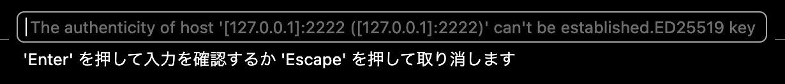

# Docker Sandbox + VS Code Remote SSH kit

`v4` は既存 sandbox へ後付けで SSH を入れるフローです。sandbox の作成自体はこの repo の責務にせず、`sbx run shell ...` などで作られた sandbox に対して `v4-include.sh` で SSH kit を導入し、`v4-connect.sh` で起動と VS Code 接続を行います。

## 使い方

1. 先に好きな方法で sandbox を作る

```bash
sbx run -d shell --name my-sandbox .
```

2. SSH kit を導入する

```bash
./v4-include.sh my-sandbox
```

3. VS Code で接続する

```bash
./v4-connect.sh
```

`v4-include.sh` は次を行います。

- 既存 sandbox を起動する
- `sbx-sshd-v4` kit を導入する
- `authorized_keys` を更新する
- sandbox を再起動する
- `12000-13000` の範囲から host port を選び、カレントディレクトリの `.sbx_remote_ssh` に書き込む

`sbx-sshd-v4` では OpenSSH の導入や host key 作成も kit の `startup` に寄せてあります。`sbx kit add` の適用対象として `startup` は含まれる一方、`install` は help 上では明示されていないため、`v4` では `install` に依存しない構成にしています。

`v4-connect.sh` は `.sbx_remote_ssh` を読み、必要なら sandbox を起動し、host port を publish してから VS Code Remote SSH を開きます。

初回時は、ssh接続先が未知のホストであるとして、以下のダイアログが表示されます。
yesと入力します（パスワード入力ダイアログとVS Codeは誤認しており、入力値はマスクされます）。



## 公開鍵

既定では次の順で公開鍵を探します。

1. `PUBLIC_KEY_PATH`
2. `~/.ssh/id_ed25519.pub`
3. `~/.ssh/id_rsa.pub`

明示したい場合:

```bash
PUBLIC_KEY_PATH="$HOME/.ssh/id_rsa.pub" ./v4-include.sh my-sandbox
```

## 変更できる環境変数

`v4-include.sh`:

```bash
SBX_SSH_USER=agent
PUBLIC_KEY_PATH=$HOME/.ssh/id_ed25519.pub
```

`v4-connect.sh`:

```bash
SBX_WAIT_SECONDS=30
```

`.sbx_remote_ssh` には次が書かれます。

```bash
SBX_SANDBOX_NAME=my-sandbox
SBX_SSH_PORT=12xxx
SBX_SSH_USER=agent
SBX_INTERNAL_SSH_PORT=2222
```

SBX_SSH_PORT は、毎回ランダムポートにすることもできますが、随時unknown hostとして検出されるため、設定で固定しています。
必要に応じて変更してください。

## デバッグ

```bash
sbx exec my-sandbox ps aux | grep '[s]shd'
sbx exec my-sandbox ss -ltnp | grep 2222
cat .sbx_remote_ssh
ssh-keygen -R "[127.0.0.1]:12xxx"
```
